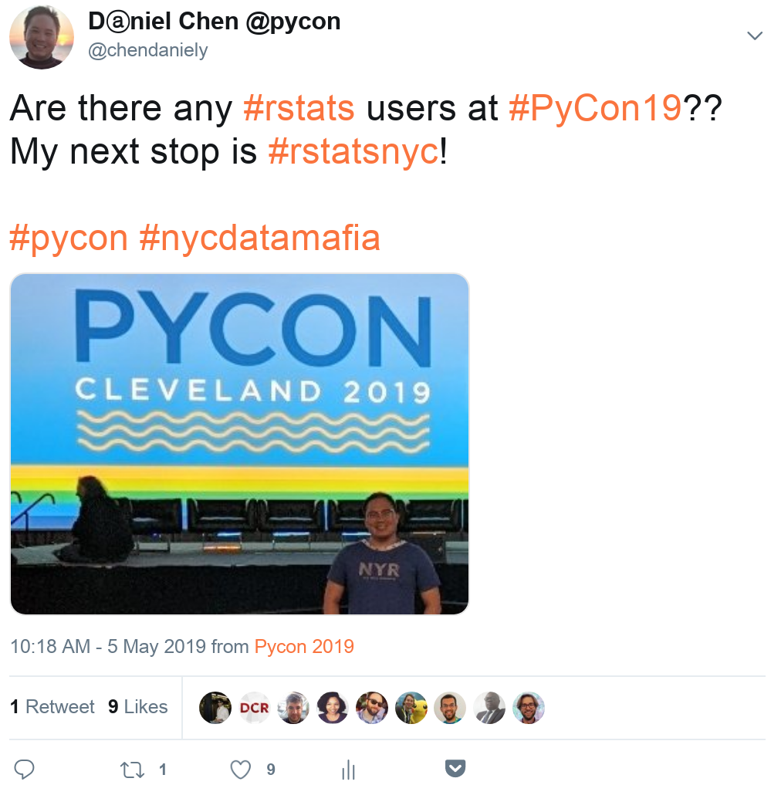
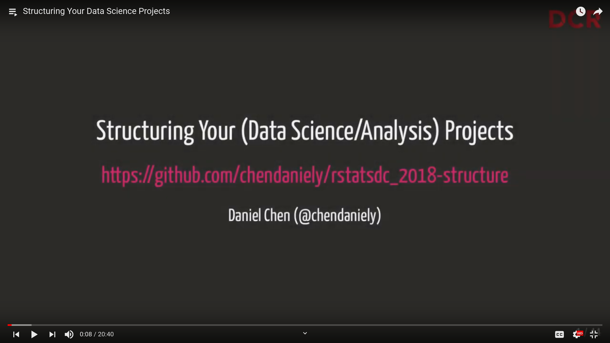
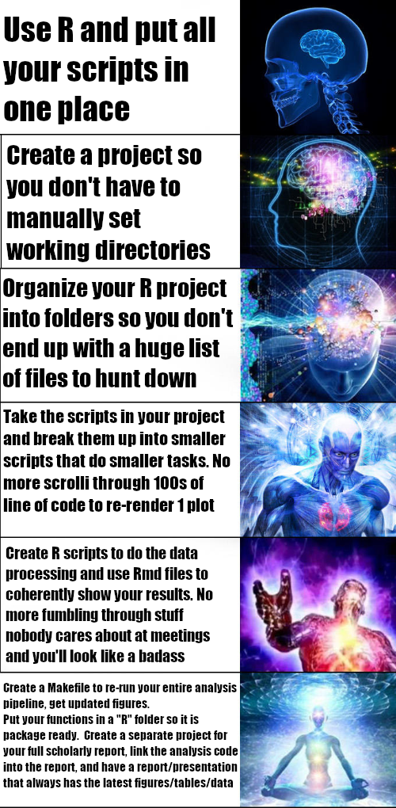
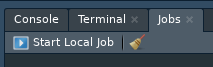
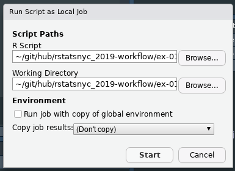
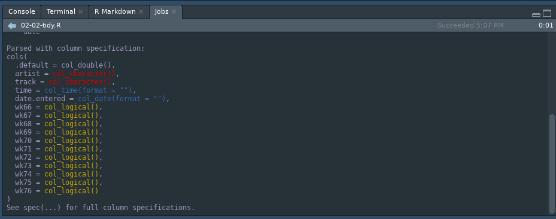

class: inverse

<style>
div.hello {
    font-size: 600px;
}

div.demo {
    font-size: 200px;
}

div.halfLink {
    font-size: 18px;
}
</style>


```{r setup, include=FALSE}
knitr::opts_chunk$set(echo = TRUE)
```

<center>
<div class="hello">hi!</div>
</center>

---

class: inverse

# I'm Daniel
.pull-left[
</img>
]

.pull-right[
- PhD Student: Virginia Tech
- Instructor
- Data Scientist
- Community Member
- RStudio Intern!
- Author:

<center>
</img>
</center>
]

---

<center>
</img>
</center>

---

class: inverse

# Caves!

### Ginnie Springs, FL

.pull-left[
</img>
]

.pull-right[
</img>
]

- https://www.submergedscuba.com/
- http://www.scuba.org.vt.edu/

---

# Continuing the DCR 2018 Story

<center>
</img>
</center>

https://youtu.be/UQHz38s3DyA

---

# Previously...

### Structuring Your Data Science Projects

We are happy when our code just runs

R has given us the tools to make your projects more structured and organized

Many people converge on very similar project templates

It doesn't matter where you are in your learning path

## tl;dr

> I just want stuff to run the first time around

---

.pull-left[
# In sum...

1. Use R
2. Make a project
3. Organize the project into folders and use `here::here()` to get project relative paths
4. Break up scripts into smaller pieces
5. RMarkdown for things you want to show
6. Put functions in `R` so your analysis is package ready and write `Makefiles`, shell scripts, or other build scripts and link your projects to scholarship so your figures and tables are always up to date
]

.pull-right[
<center>
</img>
</center>
]

---

# Where we originally started

1. A (billboard) dataset
2. A script that had everything in it

https://github.com/chendaniely/rstatsdc_2018-structure/blob/master/01-just_starting_out/analysis.R

---

# Reproducibility vs Replicability

- **reproducibility** - the extent to which consistent results are obtained when an experiment is repeated

- **replicability** - the ability of a scientific experiment or trial to be repeated to obtain a consistent result

---

```bash
☺ find . -type f -not -path './.Rproj*'
./analysis/billboard_eda/03-eda.Rmd
./analysis/billboard_eda/02-01-clean.R
./analysis/billboard_eda/02-02-tidy.R
./analysis/billboard_eda/02-03-normalize.R
./analysis/billboard_eda/01-load.R
./analysis/billboard_eda/04-model.Rmd
./Makefile
./output/billboard_reports/03-eda.html
./output/billboard_reports/04-model.html
./output/billboard_model_plots/coefs_predict_rank_week.png
./output/billboard_model_plots/coefs_predict_rank_week_no_intercept.png
./output/billboard_model_plots/coefs_predict_rank_week_artist_sorted.png
./output/billboard_model_plots/coefs_predict_rank_week_artist.png
./output/billboard_rank_plots/avg_rnk_by_week.png
./output/billboard_rank_plots/avg_rnk_by_month.png
./output/billboard_rank_plots/avg_rank_by_week_across_months.png
./data/original/billboard.csv
./data/processed/billboard/billboard_clean.csv
./data/processed/billboard/billboard.csv
./data/processed/billboard/.gitkeep
./data/processed/billboard/songs.csv
./data/processed/billboard/billboard_tidy.csv
./data/processed/billboard/rank.csv
./ex-01-make.Rproj
```

---

# Running scripts from command line

- Running form the root project directory
```bash
$ Rscript ./analysis/billboard_eda/01-load.R
```

- Running the script with `here` and `rprojroot` libraries
```bash
$ cd ./analysis/billboard_eda
$ Rscript 01-load.R
```

- Background the script
```bash
$ nohup Rscript 01-load.R &
```

---

# Jobs tab in RStudio!

.pull-left[
<center>
</img>
</center>
]

.pull-right[
<center>
</img>
</center>
]

<center>
</img>
</center>

---

# Build scripts (Make)

A task consists of:
```
target: dependency1 dependency2
    action1
    action2
```

---

# Build scripts (Make)

```make
BILLBOARD=./analysis/billboard_eda/

all : commands

## commands      : show all commands.
commands :
	@grep -E '^##' Makefile | sed -e 's/## //g'

## billboard_eda  : re-generate billboard eda analsyis
billboard_eda :
	Rscript ${BILLBOARD}/01*
	Rscript ${BILLBOARD}/02-01*
	Rscript ${BILLBOARD}/02-02*
	Rscript ${BILLBOARD}/02-03*
	Rscript -e "rmarkdown::render(here::here('./analysis/billboard_eda/03-eda.Rmd'), output_dir = './output/billboard_reports')"
	Rscript -e "rmarkdown::render(here::here('./analysis/billboard_eda/04-model.Rmd'), output_dir = './output/billboard_reports')"

## clean         : clean up junk files.
clean :
	find data/processed/ -type f -name '*.csv' | xargs rm
	find analysis/ type f -name '*.html' | xargs rm

```
---

# File inputs


| file              	| input                                           	|
|-------------------	|-------------------------------------------------	|
| 01-load.R         	| './data/original/billboard.csv'                 	|
| 02-01-clean.R     	| './data/processed/billboard/billboard.csv'      	|
| 02-02-tidy.R      	| './data/processed/billboard/billboard_clean.csv'  |
| 02-03-normalize.R 	| './data/processed/billboard/billboard_tidy.csv' 	|
| 03-eda.Rmd        	| './data/processed/billboard/rank.csv'           	|
| 04-model.Rmd      	| './data/processed/billboard/billboard_tidy.csv' 	|

---

# File outputs

| file	| output 	|  
|--------	|------------------------ |
| 01-load.R	|'./data/processed/billboard/billboard.csv' |
| 02-01-clean.R	| './data/processed/billboard/billboard_clean.csv' |
| 02-02-tidy.R	| './data/processed/billboard/billboard_tidy.csv' |
| 02-03-normalize.R	| './data/processed/billboard//songs.csv'; ./data/processed/billboard/rank.csv |
| 03-eda.Rmd | './output/billboard_rank_plots/avg_rnk_by_week.png'; ./output/billboard_rank_plots/avg_rnk_by_month.png; ./output/billboard_rank_plots/avg_rank_by_week_across_months.png  |
| 04-model.Rmd	| './output/billboard_model_plots/coefs_predict_rank_week.png'; ./output/billboard_model_plots/coefs_predict_rank_week_no_intercept.png; ./output/billboard_model_plots/coefs_predict_rank_week_artist.png 	| ./output/billboard_model_plots/coefs_predict_rank_week_artist_sorted.png 	|

---

# Build scripts (Make)

draw your DAGs (directed acylic graphs)

---

# Build scripts (Make) -- "better" Variables

```make
BILLBOARD=./analysis/billboard_eda
DO=./data/original
DP_BILLBOARD=./data/processed/billboard
O_BILLBOARD_PLOTS=./output/billboard_rank_plots
O_BILLBOARD_REPORTS=./output/billboard_reports
```
---

# Build scripts (Make) -- "better" tidy

```make
## tidy            : make tidy dataset for analysis
.PHONY: tidy
tidy: $(DP_BILLBOARD)/billboard_tidy.csv \
      $(DP_BILLBOARD)/songs.csv \
      $(DP_BILLBOARD)/rank.csv

$(DP_BILLBOARD)/billboard.csv: $(DO)/billboard.csv $(BILLBOARD)/01-load.R
	Rscript $(BILLBOARD)/01-load.R
$(DP_BILLBOARD)/billboard_clean.csv: $(DP_BILLBOARD)/billboard.csv \
                                     $(BILLBOARD)/02-01*.R
	Rscript $(BILLBOARD)/02-01*.R
$(DP_BILLBOARD)/billboard_tidy.csv: $(DP_BILLBOARD)/billboard_clean.csv \
                                    $(BILLBOARD)/02-02*.R
	Rscript $(BILLBOARD)/02-02*.R
$(DP_BILLBOARD)/songs.csv: $(DP_BILLBOARD)/billboard_tidy.csv \
                           $(BILLBOARD)/02-03*.R
	Rscript $(BILLBOARD)/02-03*.R
$(DP_BILLBOARD)/rank.csv: $(DP_BILLBOARD)/billboard_tidy.csv \
                          $(BILLBOARD)/02-03*.R
	Rscript $(BILLBOARD)/02-03*.R
```

---

# Build scripts (Make) -- "better" eda and model

```make
## eda             : create the eda report
.PHONY: eda
eda: $(DP_BILLBOARD)/rank.csv \
     $(O_BILLBOARD_REPORTS)/03-eda.html

$(O_BILLBOARD_REPORTS)/03-eda.html: $(BILLBOARD)/03-eda.Rmd
	Rscript -e "rmarkdown::render(here::here('./analysis/billboard_eda/03-eda.Rmd'), output_dir = './output/billboard_reports')"

## model           : create the model report
.PHONY: model
model: $(DP_BILLBOARD)/billboard_tidy.csv \
       $(O_BILLBOARD_REPORTS)/04-model.html
```

---

# Build scripts (Make) -- "better" eda and model

```make
## eda             : create the eda report
.PHONY: eda
eda: $(DP_BILLBOARD)/rank.csv \
     $(O_BILLBOARD_REPORTS)/03-eda.html

$(O_BILLBOARD_REPORTS)/03-eda.html: $(BILLBOARD)/03-eda.Rmd
	Rscript -e "rmarkdown::render(here::here('./analysis/billboard_eda/03-eda.Rmd'), output_dir = './output/billboard_reports')"

## model           : create the model report
.PHONY: model
model: $(DP_BILLBOARD)/billboard_tidy.csv \
       $(O_BILLBOARD_REPORTS)/04-model.html
```

---

# Build scripts (Make) -- "better" reports

```make
## reports         : create the eda and model reports
.PHONY: reports
reports: $(O_BILLBOARD_REPORTS)/03-eda.html \
         $(O_BILLBOARD_REPORTS)/04-model.html

## tidy_and_reports: run the entire tidy and report pipeline
.PHONY: tidy_and_reports
tidy_and_reports: tidy reports
```
---

```bash
make -f Makefile2 clean
make -f Makefile2 tidy_and_reports
# make -f Makefile2 tidy
# make -f Makefile2 reports
```

---

# Introducing ... drake!

```r
# Install the latest stable release from CRAN.
install.packages("drake")
```

- Just like `make` it will only run scripts for things that are out-of-date.
- If something does not need to be re-run, it won't re-run it.

- The manual: https://ropenscilabs.github.io/drake-manual
- The docs: https://ropensci.github.io/drake/

---

# But... It's not exactly like make

The reference section lists all the available functions. Here are the most important ones.

- `drake_plan()`: create a workflow data frame.
- `make()`: build your project.
- `loadd()`: load one or more built targets into your R session.
- `readd()`: read and return a built target.
- `drake_config()`: create a master configuration list for other user-side functions.
- `vis_drake_graph()`: show an interactive visual network representation of your workflow.
- `outdated()`: see which targets will be built in the next make().
- `deps()`: check the dependencies of a command or function.
- `failed()`: list the targets that failed to build in the last make().
- `diagnose()`: return the full context of a build, including errors, warnings, and messages.

---


---

class: center, middle, inverse

# Thanks!

@chendaniely

Slides: https://github.com/chendaniely/rstatsnyc_2019-workflow
